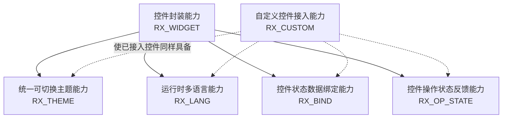
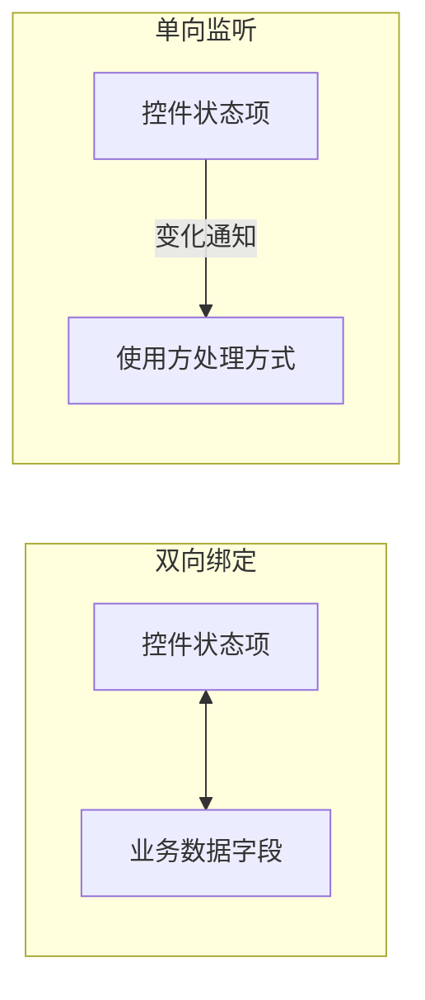
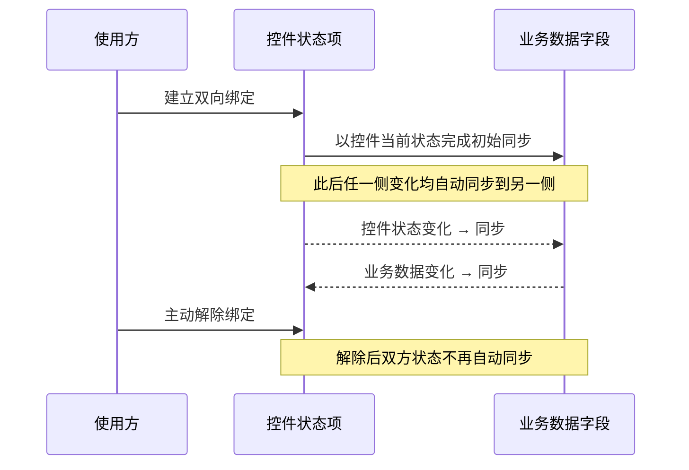
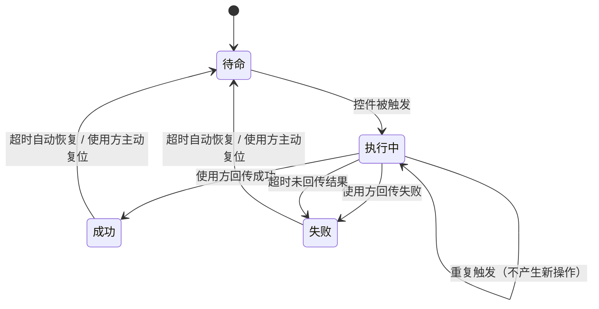
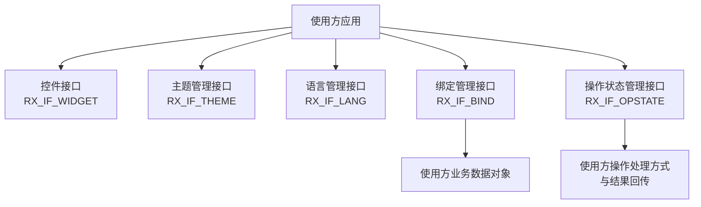

# 标准控件库（slabel）软件需求规格说明

- 文档标识符：SRS-SLABEL-001
- 版本：V1.0
- 编制日期：2026-07-24
- 编写视角：面向需求分析与评审，仅描述"需要具备什么能力"，不涉及具体实现方式

---

## 1. 范围

### 1.1 标识

本文档规定的软件配置项（CSCI）名称为"标准控件库"，内部代号 slabel，交付形态为一个供内部多个 Qt 应用共用的动态链接库。

### 1.2 概述

本软件的开发目的，是为公司内部多个基于 Qt 的应用程序提供一套统一、可复用的基础界面控件封装，使各应用无需各自重复实现下列通用能力：

- 界面风格统一并可整体切换；
- 界面语言可在运行期间切换；
- 控件状态与业务数据之间可双向联动；
- 操作触发后的执行状态可自动反馈。

本软件的使用方为公司内部各应用的开发人员，通过引用本软件对外提供的控件与管理接口完成界面开发，不需要了解本软件内部如何实现。

本文档面向需求评审人员、设计人员及测试人员，作为后续软件设计、实现与验收的依据。文档中不对上述能力"如何实现"作出规定，具体实现方式由设计阶段决定。

## 2. 引用文档

无外部引用标准文档。本规格说明依据用户原始需求描述整理形成，不依赖其他上级或同级文档。

## 3. 需求

### 3.1 能力需求（RX_BASIC_ABILITY）

为实现"提供统一、可复用的基础控件封装"这一总体目标，本软件应具备以下六项能力：**控件封装能力**、**统一可切换主题能力**、**运行时多语言能力**、**控件状态数据绑定能力**、**控件操作状态反馈能力**，以及**支持使用方自定义控件接入前述能力的能力**。

六项能力并非并列关系：控件封装能力是其余能力的承载基础，其余五项能力均依附于被封装（或被接入）的控件而存在。整体关系如下：

各项能力的详细需求分述如下。

#### 3.1.1 控件封装能力（RX_WIDGET）

##### 3.1.1.1 功能需求

软件应提供一套具有统一命名方式和使用方式的基础界面控件，供使用方应用直接使用，涵盖应用界面开发中常用的控件类型：按钮、文本标签、单行文本编辑、下拉选择、复选框、单选框、数值输入、滑动条、进度条、分组框、表格、树形列表、列表、选项卡、弹窗共十五种，构成首版核心控件集合。每个控件的创建方式、属性设置方式、事件响应方式，应与使用方已熟悉的同类原生控件保持一致。

##### 3.1.1.2 输入输出

- 输入：使用方按熟悉的方式对上述控件进行实例化、界面布局、属性设置（如文本内容、取值范围、选中状态等）与事件监听。
- 输出：控件按设置内容正常显示与交互，交互行为与原生同类控件一致；同时该控件自动具备 3.1.2～3.1.5 所述的主题、语言、绑定能力，及具备"触发操作"语义的控件自动具备操作状态反馈能力。

##### 3.1.1.3 行为过程描述

控件被创建后，应自动获得统一主题与语言能力，使用方无需为此编写额外的注册代码；控件被销毁时，应自动退出主题、语言等统一管理范围，使用方无需手动清理。

##### 3.1.1.4 行为参数

- 优先级：控件封装能力是其余各项能力的载体，其余能力均建立在控件之上。
- 异常条件及异常下的行为：控件销毁后，其在主题、语言管理范围内的登记信息应被自动清除，不应导致后续主题切换或语言切换时访问已销毁的控件。

#### 3.1.2 统一可切换主题能力（RX_THEME）

##### 3.1.2.1 功能需求

软件应为 3.1.1 所述全部控件提供统一的视觉风格，并支持在应用运行期间切换整体主题（如默认风格、深色风格等），切换后无需重启应用即可对所有已显示控件生效。同时应支持使用方按单个控件设置样式覆盖，覆盖设置的优先级应高于整体主题设置，且不受主题切换影响，即切换主题后已设置的局部覆盖仍然保留。

##### 3.1.2.2 输入输出

- 输入：用于全局切换的主题名称；用于单控件设置的样式覆盖键值对。
- 输出：应用内所有已纳入管理的控件外观按新主题即时刷新；已设置覆盖的控件在刷新后仍保持其覆盖样式。

##### 3.1.2.3 行为过程描述

1. 使用方预先登记可用主题后，指定切换到某一主题；
2. 软件对该主题下的全部已纳入管理的控件外观进行统一应用；
3. 若某控件设置了样式覆盖，该控件应在统一外观之上叠加其覆盖设置，最终呈现覆盖后的样式；
4. 使用方可清除某控件的样式覆盖，使其恢复为跟随整体主题的统一样式。

对于采用自定义绘制方式实现（不使用标准控件外观）的界面元素，软件应额外提供按语义名称（如"主色"）查询当前主题对应颜色的方式，供使用方在自行绘制时取色使用，并应在主题切换时给出通知，以便使用方重新绘制。

##### 3.1.2.4 行为参数

- 响应时间：主题切换应在一次界面刷新周期内完成，不应产生用户可感知的明显延迟或界面闪烁。
- 优先级：控件级样式覆盖优先于整体主题设置。
- 异常条件及异常下的行为：当指定的主题名称未登记，或该主题对应的资源无法加载时，切换操作应失败并保持当前生效主题不变，不应导致界面异常或程序崩溃。

#### 3.1.3 运行时多语言能力（RX_LANG）

##### 3.1.3.1 功能需求

软件应支持应用界面语言在运行期间切换（如中文、英文），切换后无需重启应用，所有已显示控件的文字内容应自动更新为目标语言。

##### 3.1.3.2 输入输出

- 输入：目标语言标识。
- 输出：应用内所有已纳入管理的控件当前显示的文字内容更新为目标语言对应译文；若某文字缺少对应译文，应有明确的兜底显示方式。

##### 3.1.3.3 行为过程描述

1. 使用方指定切换到某语言；
2. 软件加载该语言对应的翻译资源；
3. 已显示的全部控件的文字内容，包括控件创建时设置的固定文案，以及使用方在运行期间动态设置的文案，均应重新求值为目标语言译文并刷新显示。

##### 3.1.3.4 行为参数

- 响应时间：语言切换应在一次界面刷新周期内完成。
- 异常条件及异常下的行为：当指定语言对应的翻译资源不存在或加载失败时，切换操作应失败，且不应影响当前已生效的语言与界面上已显示的文字内容，即界面应维持切换前的状态。

#### 3.1.4 控件状态数据绑定能力（RX_BIND）

##### 3.1.4.1 功能需求

软件应支持将控件的状态（如文本内容、数值、选中状态等）与使用方的业务数据字段建立关联，关联方式分两种：

- **双向绑定**：控件状态变化时同步更新对应的业务数据字段，业务数据字段变化时同步更新对应的控件状态；
- **单向监听**：仅在控件状态发生变化时通知使用方，不要求业务数据字段回写控件。

使用方应能随时解除已建立的绑定或监听关系。两种关联方式的数据流向如下：

##### 3.1.4.2 输入输出

- 输入：建立绑定时，需提供控件及其状态项、业务数据对象及其字段的标识；建立单向监听时，另需提供状态变化时的处理方式。
- 输出：双向绑定建立后，双方状态项保持一致；单向监听建立后，业务数据侧可感知到控件状态的每次变化。

##### 3.1.4.3 行为过程描述

以双向绑定的建立与后续同步为例，时序如下：

补充规则：

1. 使用方对同一控件状态项重复建立绑定或监听关系时，软件应以最新一次建立的关系为准，此前建立的关系应自动解除；
2. 绑定关系中任一端被销毁时，软件应自动解除该绑定关系，不应因此影响关系另一端的正常使用。

##### 3.1.4.4 行为参数

- 时序：状态同步应为即时同步，即状态发生变化后立即触发对端更新，不允许采用轮询等待或延迟批量处理的方式。
- 异常条件及异常下的行为：
  1. 双向绑定中一方变化引发另一方变化、又反向引发原方变化的连锁反应（即 A 变化引起 B 变化，B 变化又试图引起 A 变化）不应造成循环触发或死循环；
  2. 绑定关系中一端已被销毁后，另一端继续发生状态变化，不应导致异常或程序崩溃；
  3. 在单向监听的处理方式内部解除该监听自身，不应导致异常或程序崩溃。

#### 3.1.5 控件操作状态反馈能力（RX_OP_STATE）

##### 3.1.5.1 功能需求

软件应支持使用方将控件的"触发操作"（如按钮被点击）与该操作的执行过程建立关联，使控件能够依次呈现"待命""执行中""成功""失败"四种状态，并在每种状态下给出默认的可视化反馈（如外观、文字提示的变化），无需使用方自行绘制；使用方也可按 3.1.2 所述的样式覆盖方式，对各状态下的呈现效果进行定制。

该能力应适用于软件提供的所有具备"触发操作"语义的控件（如按钮等），不局限于某一种特定控件。四种状态及其迁移关系如下：

##### 3.1.5.2 输入输出

- 输入：使用方为某控件登记其被触发时要执行的处理方式；该处理方式执行结束后，由使用方告知本次操作的结果（成功或失败）。
- 输出：控件被触发后自动进入"执行中"状态；操作结束后按结果自动切换为"成功"或"失败"状态对应的呈现效果；经过一段时间后或经使用方主动复位，控件恢复为"待命"状态，重新允许被触发。

##### 3.1.5.3 行为过程描述

1. 控件初始处于"待命"状态，允许被触发；
2. 控件被触发后，软件立即将其切换为"执行中"状态；
3. 使用方在其登记的处理方式中完成实际业务处理后，将结果（成功或失败）告知软件；
4. 软件根据结果将控件切换为对应的"成功"或"失败"状态，并呈现相应的默认反馈效果；
5. "成功"或"失败"状态在软件给定的时间之后，或经使用方主动复位后，恢复为"待命"状态。

##### 3.1.5.4 行为参数

- 时序：控件被触发后应立即切换为"执行中"状态，不等待实际业务处理开始，使使用方第一时间获得反馈；由"成功"/"失败"状态自动恢复为"待命"状态的等待时间应可由使用方配置。
- 异常条件及异常下的行为：
  1. 控件处于"执行中"状态期间，重复触发该控件不应产生新的操作，也不应导致异常；
  2. 若控件在"执行中"状态下被销毁，不应导致异常或程序崩溃；
  3. 若使用方在其配置的超时时间内未告知操作结果，软件应自动将控件切换为"失败"状态，不应使控件无限期停留在"执行中"状态。

#### 3.1.6 自定义控件接入能力（RX_CUSTOM）

##### 3.1.6.1 功能需求

软件应支持使用方将自行开发的、基于 Qt 框架的界面控件接入本软件的主题、语言、绑定、操作状态反馈能力，而不局限于 3.1.1 所列的首版核心控件集合。

##### 3.1.6.2 输入输出

- 输入：使用方自行开发的界面控件。
- 输出：该控件具备与首版核心控件集合相同的主题跟随能力、语言跟随能力（若该控件具备可翻译文本）、数据绑定能力，以及在具备"触发操作"语义时的操作状态反馈能力。

##### 3.1.6.3 行为过程描述

使用方按软件规定的接入方式将自定义控件纳入统一管理后，该控件在主题切换、语言切换、数据绑定、操作状态反馈方面的行为，应与首版核心控件集合完全一致。若该自定义控件为完全自绘制（不使用标准控件外观），软件应提供 3.1.2 所述的主题颜色查询方式供其使用。

##### 3.1.6.4 行为参数

异常条件及异常下的行为：若自定义控件不具备可翻译文本能力，语言切换时应跳过对该控件文字内容的重译处理，不应导致异常。

### 3.2 外部接口需求（RX_interface）

#### 3.2.1 接口标识和接口图

本软件对使用方应用提供四类管理接口与一类控件接口。其中绑定管理接口的另一端还连接使用方提供的业务数据对象；操作状态管理接口的另一端连接使用方提供的操作处理方式与结果回传。

#### 3.2.2 控件接口（RX_IF_WIDGET）

使用方以创建原生控件相同的方式创建、配置、销毁本软件提供的各类控件；控件的使用方式与原生同类控件保持一致，不新增额外的强制调用步骤。

#### 3.2.3 主题管理接口（RX_IF_THEME）

1. 登记主题：由主题名称与主题资源位置构成，供软件后续按名称加载使用；
2. 切换主题：按已登记的主题名称切换当前生效主题，并返回本次切换是否成功；
3. 查询当前主题：返回当前生效的主题名称；
4. 单控件样式覆盖设置与清除：以键值对形式对指定控件设置或清除样式覆盖；
5. 主题颜色查询：按语义名称查询当前主题下对应的颜色取值，供自绘控件使用。

#### 3.2.4 语言管理接口（RX_IF_LANG）

1. 切换语言：按语言标识切换当前生效语言，并返回本次切换是否成功；
2. 查询当前语言：返回当前生效的语言标识；
3. 动态文案登记：供控件在运行期间设置需随语言切换自动重新翻译的文字内容。

#### 3.2.5 绑定管理接口（RX_IF_BIND）

1. 建立双向绑定：指定控件状态项与业务数据字段；
2. 建立单向监听：指定控件状态项与状态变化时的处理方式；
3. 解除绑定或监听：按控件状态项标识解除已建立的关系。

#### 3.2.6 操作状态管理接口（RX_IF_OPSTATE）

1. 触发登记：为具备"触发操作"语义的控件登记被触发时执行的处理方式，以及自"成功"/"失败"状态自动恢复为"待命"状态的等待时间；
2. 结果回传：使用方在处理方式执行结束后，告知本次操作结果（成功或失败）；
3. 状态查询：查询控件当前所处的操作状态；
4. 复位：使控件从"成功"或"失败"状态提前恢复为"待命"状态。

### 3.3 内部接口需求（rx_in_interface）

本规格说明不对内部接口提出额外需求，内部接口的具体设计留待《软件设计说明》阶段确定。

### 3.4 内部数据需求（rx_in_data）

本规格说明不对内部数据结构提出额外需求，相关内容留待《软件设计说明》阶段确定。

### 3.5 设计和实现约束（rx_design）

以下为使用环境与交付形式对本软件提出的既定约束，不涉及内部具体实现方式：

1. 运行环境：软件应同时兼容 Qt 5.15.2 与 Qt 5.15.10 版本环境，应能在 Windows 7 与 Linux 操作系统上正常运行；
2. 编程语言：应使用 C++17 标准编写；
3. 交付形式：应以动态链接库形式交付，不提供静态库形式；
4. 构建方式：应同时提供 CMake 与 qmake 两种构建配置，两者产出的库应具有一致的对外能力；
5. 易用性约束：控件的对外使用方式应尽量贴近使用方已熟悉的原生控件使用方式，基本使用不应引入额外的强制步骤；
6. 文档与代码语言：软件源代码注释及配套文档应使用简体中文编写。

### 3.6 其他需求（rx_other）

1. 首版控件集合范围为 3.1.1 所述十五种核心控件，其余控件类型按相同封装方式在后续版本扩充，不属首版强制范围；
2. 软件不要求兼容 Qt 6 及更高版本；
3. 软件各项能力需求均应具备可验证性，应能够通过自动化测试用例验证其正确性；
4. 各项能力在运行期间不应引入使用方可感知的性能开销或响应延迟，具体的性能达成方式由设计阶段决定。

## 4. 注释

- **CSCI**：计算机软件配置项（Computer Software Configuration Item）。
- **主题**：应用界面统一的配色方案与控件外观风格设定的集合。
- **双向绑定**：控件状态与业务数据字段之间建立的、任一侧变化均自动同步到另一侧的关联关系。
- **单向监听**：仅在控件状态变化时通知使用方、不要求反向同步的关联关系。
- **自绘控件**：不使用标准控件外观、由使用方自行绘制界面内容的控件。
- **操作状态**：具备"触发操作"语义的控件（如按钮）在一次操作生命周期内所处的阶段，包括待命、执行中、成功、失败四种。
